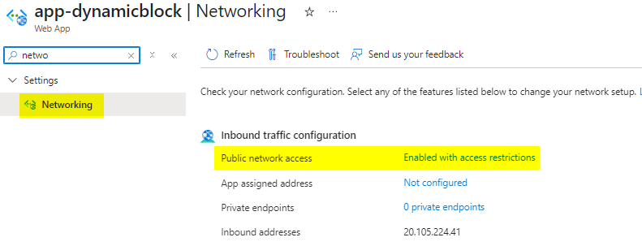
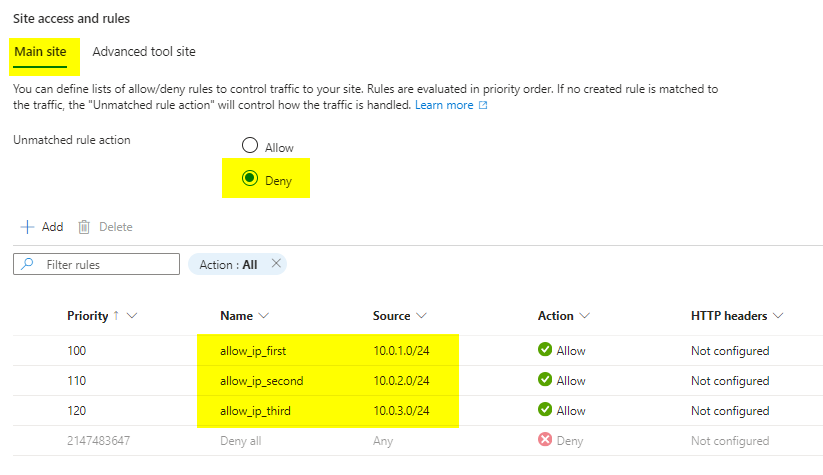

# Lab overview

In this lab, you will learn how to deploy resources using multiple nested blocks of same kind.
We will define a variable as a map of objects to handle IP restriction values for an App Service, and use this variable data through a `dynamic` block in the App Service resource block.

- [Lab overview](#lab-overview)
  - [Objectives](#objectives)
  - [Instructions](#instructions)
    - [Before you start](#before-you-start)
    - [Exercise 1: Setup your environment (*tfstate* and project template)](#exercise-1-setup-your-environment-tfstate-and-project-template)
      - [Backend](#backend)
      - [Variables](#variables)
    - [Exercise 2: Deploy multiple IP Restrictions on an App Service](#exercise-2-deploy-multiple-ip-restrictions-on-an-app-service)
      - [Variable set](#variable-set)
      - [Provider](#provider)
      - [Resources](#resources)
      - [Deploy](#deploy)
      - [Remove resources](#remove-resources)

## Objectives

After you complete this lab, you will be able to:

- Create multiple IP restrictions for an App Service,
- Understand how Terraform handles dynamic blocks.

## Instructions

### Before you start

- Ensure Terraform (version ~> 1.13.0) is installed and available from system PATH.
- Ensure Azure CLI is installed.
- Check your access to the Azure Subscriptions and Resource Groups provided for this training.

### Exercise 1: Setup your environment (*tfstate* and project template)

1/ Create the container for *tfstate*

In your *main* Resource Group (the one tagged with `layer` = `main`), create a Storage Account, with a Blob container named `tfstate` to store the *tfstate* file.

2/ Get project template

Clone the repository https://github.com/Anne-Gaelle-Cellenza/training-terraform-intermediate-labs-setup

```bash
git clone https://github.com/Anne-Gaelle-Cellenza/training-terraform-intermediate-labs-setup.git
cd training-terraform-intermediate-labs-setup
```

> This template contains a basic Terraform project configuration that:
>
> - uses a `data` resource group,
> - defines two variables `resource_group_name` and `location`,
> - contains a `configuration\dev` folder with *backend* and *tfvars* for dev.

3/ Configure the project template to use your environment

#### Backend

The project template uses a partial backend configuration: we don't define the backend configuration in the `terraform` block but in an external file, read at `terraform init` time.

In the *configuration/dev* folder, update the `backend.hcl` file as:

```hcl
  resource_group_name  = "the_name_of_your_main_resource_group"
  storage_account_name = "the_name_of_the_storage_account_you_just_created"
  container_name      = "tfstate"
  key                 = "dynamicappservice.tfstate"
```

> Define your backend using the Storage Account you created few minutes ago.

#### Variables

In the *configuration/dev* folder, update the `dev.tfvars` file:

```hcl
resource_group_name = "the_name_of_your_main_resource_group"
```

### Exercise 2: Deploy multiple IP Restrictions on an App Service

#### Variable set

In the `variables.tf` file, add the `ip_restrictions` declaration as

```hcl
variable "ip_restrictions" {
  type = map(object({
    ip_address = string
    priority   = number
    action     = string
  }))
  description = "List of IP restrictions"
}
```

> This variable is a map of object.
> Using a map rather than a set allows you to specify multiple attributes for each item.

Define values for this new variable in `dev.tfvars` under *configuration/dev* folder as:

```hcl
ip_restrictions = {
    "allow_ip_first" = {
        ip_address = "10.0.1.0/24"
        priority = 100
        action = "Allow"
    }
    "allow_ip_second" = {
        ip_address = "10.0.2.0/24"
        priority = 110
        action = "Allow"
    }
    "allow_ip_third" = {
        ip_address = "10.0.3.0/24"
        priority = 120
        action = "Allow"
    }
}
```

> An IP Restriction block for an App Service Plan requires ip_address, priority, action and name properties.

#### Provider

**IMPORTANT**
We will be targeting here a deployment to what we used to call the *main* subscription in previous lab *01_DeployToMultipleSubscription*.
**Verify that the file `provider.tf` has the required provider block to address the creation of the resources.**

#### Resources

Reference the resource group to use (in *main* subscription) and add the App Service Plan `resource` block in `main.tf` file:

```hcl
data "azurerm_resource_group" "self" {
  name = var.resource_group_name
}

resource "azurerm_service_plan" "AppSvcPlan" {
  name                = "asp-dynamicblock"
  location            = data.azurerm_resource_group.self.location
  resource_group_name = data.azurerm_resource_group.self.name

  os_type  = "Linux"
  sku_name = "B1"
}

resource "azurerm_linux_web_app" "AppSvc" {
  name                          = "app-dynamicblock"
  location                      = data.azurerm_resource_group.self.location
  resource_group_name           = data.azurerm_resource_group.self.name
  service_plan_id               = azurerm_service_plan.AppSvcPlan.id

  site_config {
    dynamic "ip_restriction" {
      # value to iterate over 
      for_each = var.ip_restrictions

      content {
        action     = ip_restriction.value.action
        ip_address = ip_restriction.value.ip_address
        name       = ip_restriction.key
        priority   = ip_restriction.value.priority
      }
    }

    ip_restriction_default_action     = "Deny"
    scm_ip_restriction_default_action = "Deny"
  }
}
```

> Notice the dynamic block of ip_restriction kind:
>
> - the for_each argument is set to the map we defined,
> - the content of each block is created using attributes specified for each occurence.

#### Deploy

Run the following commands to deploy resources:

PowerShell

```powershell
az login
az account set --subscription "the_main_subscription_id"
$env:ARM_SUBSCRIPTION_ID="the_main_subscription_id"
# use the '-reconfigure' option in case your local folder was previously configured with a different backend (e.g. from previous labs)
terraform init -backend-config="..\configuration\dev\backend.hcl" -reconfigure
terraform apply -var-file="..\configuration\dev\dev.tfvars" -auto-approve
```

Bash

```bash
az login
az account set --subscription "the_main_subscription_id"
export ARM_SUBSCRIPTION_ID="the_main_subscription_id"
# use the '-reconfigure' option in case your local folder was previously configured with a different backend (e.g. from previous labs)
terraform init -backend-config="..\configuration\dev\backend.hcl" -reconfigure
terraform apply -var-file="..\configuration\dev\dev.tfvars" -auto-approve
```

> Check in the Azure Portal
>
> - that the App Service and ASP are deployed,
> - and that the App Service has access restriction matching the provided rules.
>
> 
>
> 

#### Remove resources

Remove the resources using the command

```powershell
terraform destroy -var-file="..\configuration\dev\dev.tfvars" -auto-approve
```

