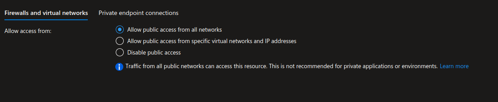

# Lab overview

In this lab, you will learn how to manage conditional in terraform configuration.  
We define inputs and condition the KV settings to that input values.

- [Lab overview](#lab-overview)
  - [Objectives](#objectives)
  - [Instructions](#instructions)
    - [Before you start](#before-you-start)
    - [Exercise 1: Setup your environment (*tfstate* and project template)](#exercise-1-setup-your-environment-tfstate-and-project-template)
      - [Backend](#backend)
      - [Variables](#variables)
    - [Exercise 2: Use conditional to change an argument based on condition](#exercise-2-use-conditional-to-change-an-argument-based-on-condition)
      - [Variable set](#variable-set)
      - [Provider](#provider)
      - [Resources](#resources)
      - [Deploy](#deploy)
      - [Update config](#update-config)
    - [Exercise 3: Use conditional to enable/disable a resource based on condition](#exercise-3-use-conditional-to-enabledisable-a-resource-based-on-condition)
      - [Variable set](#variable-set-1)
      - [Deploy](#deploy-1)
      - [Remove resources](#remove-resources)

## Objectives

After you complete this lab, you will be able to:

- Create a Key Vault,
- Vary the KV settings based on conditional input.

## Instructions

### Before you start

- Ensure Terraform (version ~> 1.13) is installed and available from system's PATH.
- Ensure Azure CLI is installed.
- Check your access to the Azure Subscriptions and Resource Groups provided for this training.

### Exercise 1: Setup your environment (*tfstate* and project template)

1/ Create the container for *tfstate*

In your *main* Resource Group (the one tagged with `layer` = `main`), create a Storage Account, with a Blob container named `tfstate` to store the *tfstate* file.

2/ Get project template

Clone the repository https://github.com/Anne-Gaelle-Cellenza/training-terraform-intermediate-labs-setup

```bash
git clone https://github.com/Anne-Gaelle-Cellenza/training-terraform-intermediate-labs-setup.git
cd training-terraform-intermediate-labs-setup
```

> This template contains a basic Terraform project configuration that:
>
> - uses a `data` resource group,
> - defines two variables `resource_group_name` and `location`,
> - contains a `configuration\dev` folder with *backend* and *tfvars* for dev.

3/ Configure the project template to use your environment

#### Backend

The project template uses a partial backend configuration: we don't define the backend configuration in the `terraform` block but in an external file, read at `terraform init` time.

In the *configuration/dev* folder, update the `backend.hcl` file as:

```hcl
  resource_group_name  = "the_name_of_your_main_resource_group"
  storage_account_name = "the_name_of_the_storage_account_you_just_created"
  container_name      = "tfstate"
  key                 = "useconditional.tfstate"
```

> Define your backend using the Storage Account you created few minutes ago.

#### Variables

In the *configuration/dev* folder, update the `dev.tfvars` file:

```hcl
resource_group_name = "the_name_of_your_main_resource_group"
```

### Exercise 2: Use conditional to change an argument based on condition

#### Variable set

In the `variables.tf` file, add a new variable:

```hcl
variable "Kv" {
  type = object({
    KvName             = string
    KvRgName           = string
    KvLocation         = string
    IsKvPublic         = optional(bool,true) 
    KvEnableRbac       = optional(bool,true) 
    KvNAclBypassConfig = optional(string,"AzureServices")
  })
}
```

> This variable is an object, i.e. a fixed schema with named attributes, each having its own type.

Define the key vault values in `dev.tfvars` file:

```hcl
Kv = {
  KvLocation = "eastus"
  KvName     = "<a_unique_key_vault_name>"  # <-- set a unique KV name (use your trigram)
  KvRgName   = "<your_resource_group_name>" # <-- set you RG name
}
```

#### Provider

**IMPORTANT**  
We will be targeting here a deployment to what we used to call the *main* subscription in previous lab *01_DeployToMultipleSubscription*.  
**Verify that the file `provider.tf` has the required provider block to address the creation of the resources.**

#### Resources

Reference the resource group to use (in *feature* subscription) and add the Virtual Network `resource` block in `main.tf` file:

```hcl
data "azurerm_resource_group" "feature_rg" {
  name = var.feature_rg
}

resource "azurerm_key_vault" "Kv" {
  name                      = var.Kv.KvName
  resource_group_name       = var.Kv.KvRgName
  location                  = var.Kv.KvLocation
  sku_name                  = "standard"
  tenant_id                 = data.azurerm_client_config.currentclientconfig.tenant_id
  enable_rbac_authorization = var.Kv.KvEnableRbac
  network_acls {
    bypass         = var.Kv.KvNAclBypassConfig
    default_action = local.KvNAclDefaultAction
  }
}
```

This resource block uses a local for `default_action` in `network_acls` and a `data` block for `tenant_id`. Both need to be defined.  
Add a new file named `local.tf` and fill it with:

```hcl
locals {
  # if KV is public, set default action to 'Allow' else 'Deny'
  KvNAclDefaultAction = var.Kv.IsKvPublic ? "Allow" : "Deny"
}
```

Add the `data` block to `main.tf` as:

```hcl
# get information on the currently authenticated Azure cleint
# this is the identity Terraform  is using to talk to Azure
data "azurerm_client_config" "currentclientconfig" {}
```

#### Deploy

Run the following commands to initialize your terraform environment and deploy the resources:

PowerShell

```powershell
az login
az account set --subscription "the_main_subscription_id"
$env:ARM_SUBSCRIPTION_ID="the_main_subscription_id"
# use the '-reconfigure' option in case your local folder was previously configured with a different backend (e.g. from previous labs)
terraform init -backend-config="..\configuration\dev\backend.hcl" -reconfigure
terraform apply -var-file="..\configuration\dev\dev.tfvars" -auto-approve
```

Bash

```bash
az login
az account set --subscription "the_main_subscription_id"
export ARM_SUBSCRIPTION_ID="the_main_subscription_id"
# use the '-reconfigure' option in case your local folder was previously configured with a different backend (e.g. from previous labs)
terraform init -backend-config="..\configuration\dev\backend.hcl" -reconfigure
terraform apply -var-file="..\configuration\dev\dev.tfvars" -auto-approve
```

> Check in the Azure Portal the created Key Vault and its network configuration.  
> Network is not restricted, because result for `KvNAclDefaultAction = var.Kv.IsKvPublic ? "Allow" : "Deny"` without a `IsKvPublic` attribute specifically defined for the variable results into `Allow` (default value for `IsKvPublic` is *true*).



#### Update config

In `dev.tfvars`, add the following line to change the value of `Kv.IsKvPublic`:

```hcl
Kv = {
    KvLocation = "eastus"
    KvName     = "<a_unique_key_vault_name>"  # <-- set a unique KV name (use your trigram)
    KvRgName   = "<your_resource_group_name>" # <-- set you RG name
    IsKvPublic = false
  }
```

Run a plan to view the proposed change. A unique change should be displayed as:

```bash
Terraform will perform the following actions:

  # azurerm_key_vault.Kv will be updated in-place
  ~ resource "azurerm_key_vault" "Kv" {
        id                              = "/subscriptions/00000000-0000-0000-000000000000/resourceGroups/rsg-ciliumlabntw/providers/Microsoft.KeyVault/vaults/your_kv_name"
        name                            = "your_kv_name"
        tags                            = {}
        # (13 unchanged attributes hidden)

      ~ network_acls {
          ~ default_action             = "Allow" -> "Deny"
            # (3 unchanged attributes hidden)
        }
    }

Plan: 0 to add, 1 to change, 0 to destroy.
```

Apply the change and check the resource again frm Azure portal:


### Exercise 3: Use conditional to enable/disable a resource based on condition

A key vault can be used with rbac or with access policy. In the first casae, sepcific Azure rbac roles need to be assigned to the users so that they can access the elments in the key vault. In the second case, access policies have to be defined on the key vault to give access to users on the differents object types.

#### Variable set

In the main file, add the following configuration:

```hcl
resource "azurerm_key_vault_access_policy" "KvAccessPolicy" {
  # this resource is only defined if condition is false
  count = var.Kv.KvEnableRbac ? 0 : 1

  key_vault_id = azurerm_key_vault.Kv.id
  tenant_id    = data.azurerm_client_config.currentclientconfig.tenant_id
  object_id    = data.azurerm_client_config.currentclientconfig.object_id

  key_permissions = [
    "Get",
  ]
  secret_permissions = [
    "Get",
  ]
}
```

#### Deploy

Run a plan and observe the proposed changes.  

Next, update the `Kv.KvEnableRbac` value to `false` and the `Kv.IsKvPublic` to `true` in `dev.tfvars`.  
Re-run terraform plan and apply.  
Check the Key vault from the Azure portal:


#### Remove resources

Remove the resources using the command

```powershell
terraform destroy -var-file="..\configuration\dev\dev.tfvars" -auto-approve
```
